# System Architecture

The project is divided into separate workflows so intake, qualification, CRM work, review, follow-up, reporting, and failure handling can be maintained independently.

The main processing flow is:

Gmail / Website
→ Intake and normalization
→ Duplicate protection
→ AI-assisted qualification
→ Qualification and routing

From there, the lead follows the appropriate path:

- Qualified leads continue into HubSpot CRM synchronization.
- Leads that require review are sent through the internal notification and review portal.
- Approved reviewed leads enter the approved follow-up workflow, which uses the Approved HubSpot CRM Stage before preparing the remaining follow-up work.
- Rejected leads stop without creating approved customer follow-up.

Daily reporting and failure handling operate alongside the lead-processing workflows rather than as sequential stages in the lead path.
Each workflow has a defined responsibility and writes important state back to the Lead Operations Register so later stages can verify what has already happened.

## 01 — Gmail Lead Intake

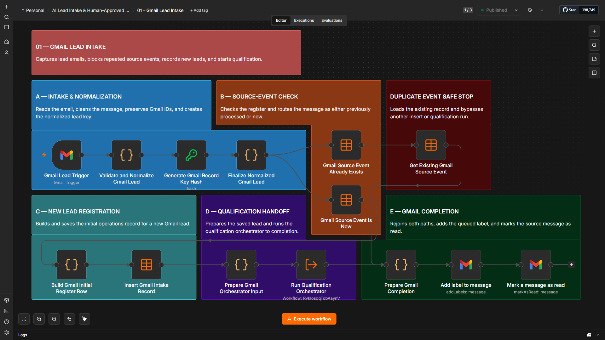

This workflow monitors the approved Gmail lead source, normalizes the incoming lead data, checks whether the source event has already been processed, writes new intake records to the Lead Operations Register, and hands valid new leads to the qualification workflow.

A successful execution example is included below.

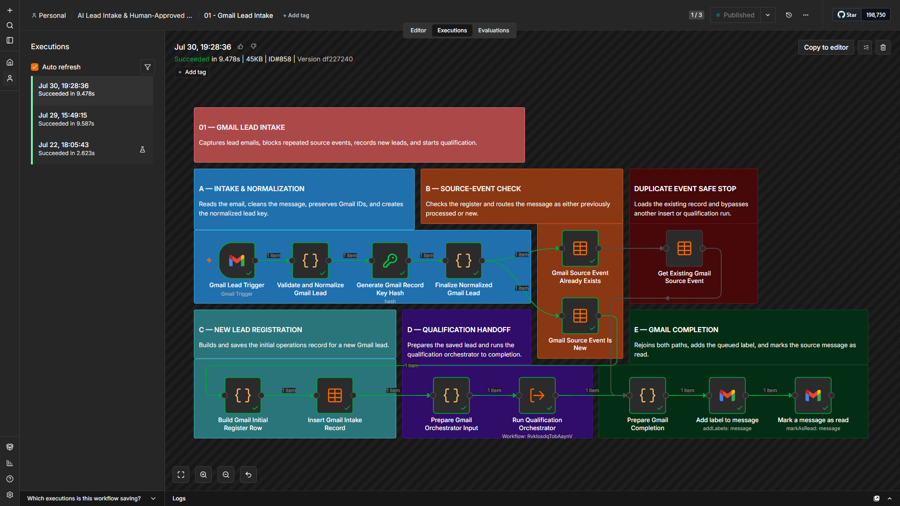

## 02 — Website Lead Intake

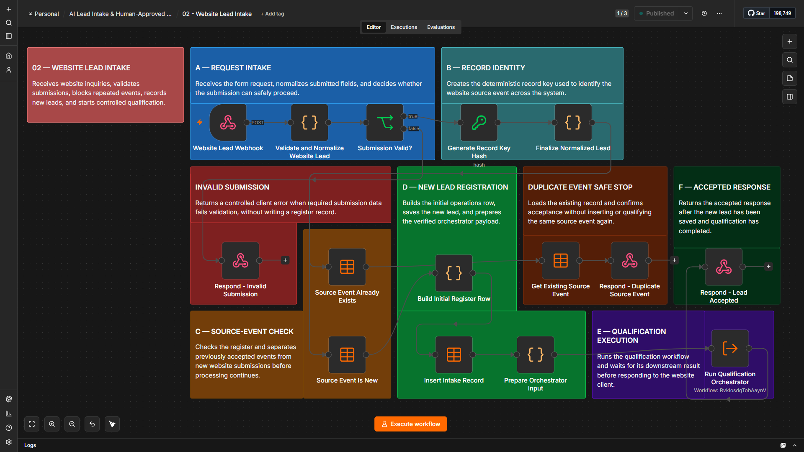

This workflow accepts website lead submissions, normalizes the incoming data, creates a deterministic record key, and checks whether the same source event has already been accepted.

If the source event already exists, the workflow returns the existing record and stops further processing. New events are written to the Lead Operations Register and passed to the qualification workflow.

## 03 — AI Lead Qualification Orchestrator

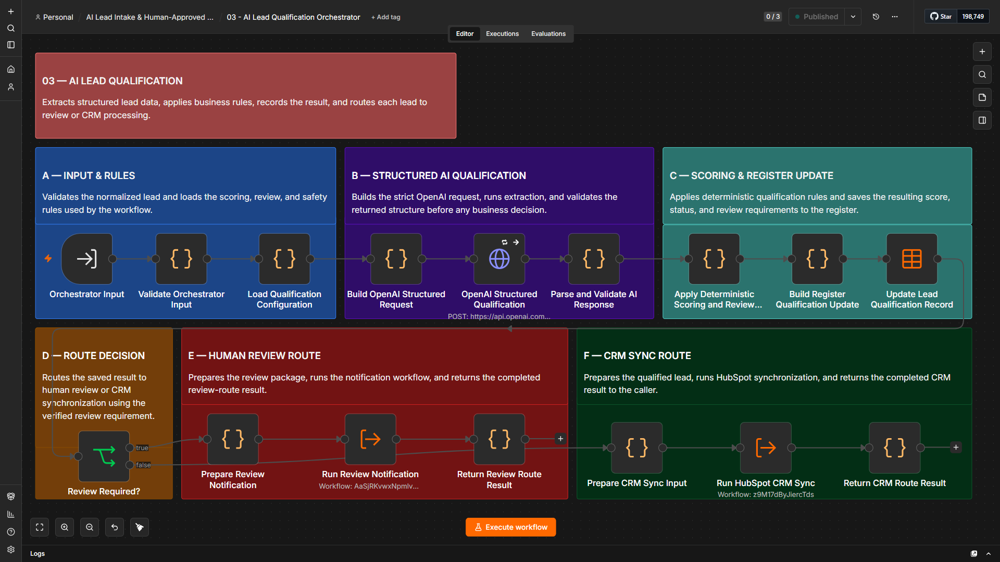

This workflow evaluates each lead using AI-assisted analysis together with fixed qualification rules.

Before the AI result is used, the response is validated. If the response is incomplete, malformed, or otherwise unusable, the lead is routed to human review instead of being treated as successfully qualified.

The final routing outcome is one of three states:

- Qualified
- Review required
- Rejected

This keeps the AI advisory rather than allowing an unchecked model response to control the downstream business process.

## 04 — HubSpot CRM Synchronization

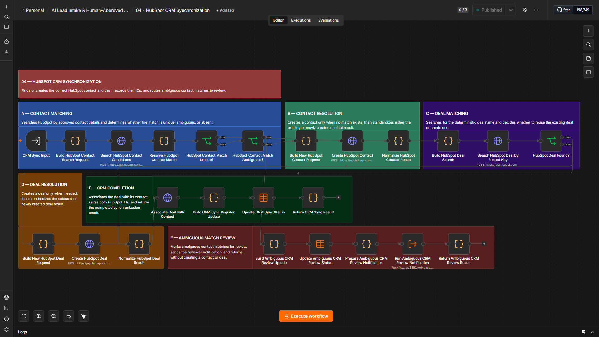

This workflow handles the CRM side of the lead process.

It checks the current HubSpot state, resolves whether the contact already exists, updates or creates the required CRM records, and preserves the resulting HubSpot contact and deal IDs in the Lead Operations Register.

Keeping those external IDs in the register allows later workflow stages to verify existing CRM state before creating or updating anything again.

## 05 — Lead Review Notification

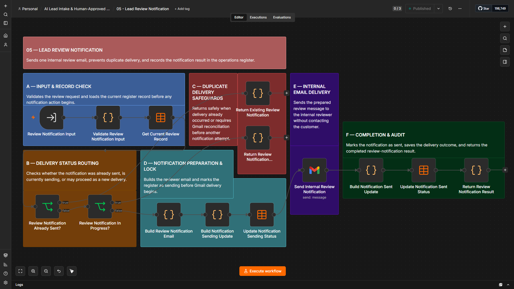

This workflow handles the internal notification for leads that require a human decision.

It prepares the review context and sends the reviewer the information needed to evaluate the lead, including the qualification result, score, confidence, estimated value, and the reason the record was held.

The notification links the reviewer into the controlled review process rather than allowing an uncertain lead to continue automatically.

## 06 — Lead Review Portal API

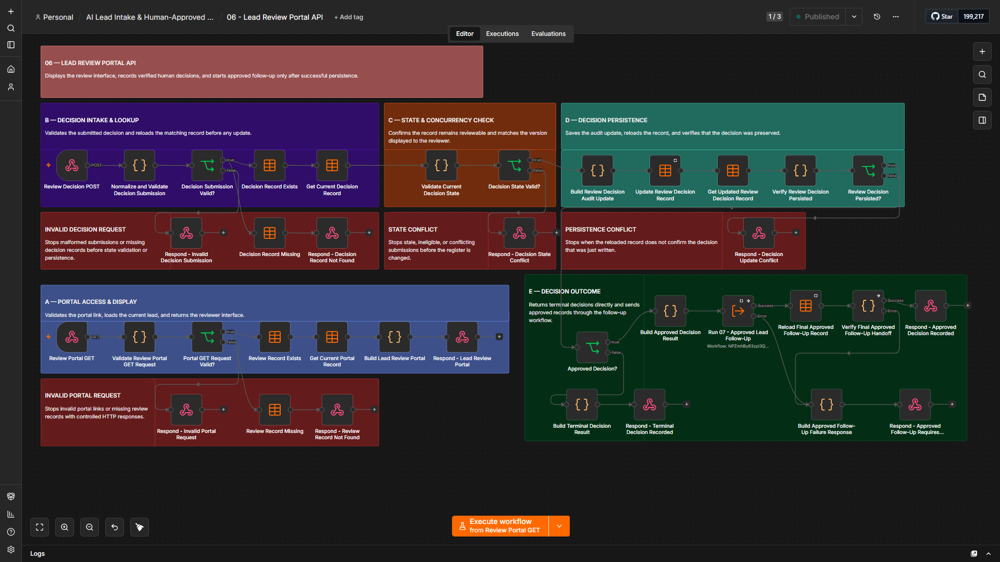

This workflow provides the browser-based review interface and records the reviewer’s decision.

It handles both the review page and the submitted decision, checks whether a decision has already been recorded, and prevents duplicate approval or rejection actions.

For approved leads, it hands the record to the approved follow-up workflow, reloads the final persisted state, verifies that the downstream work completed correctly, and only then returns the final success response to the reviewer.

If the approved follow-up does not complete correctly, the workflow returns a controlled attention response instead of presenting a false success state.

## 07 — Approved Lead Follow-Up

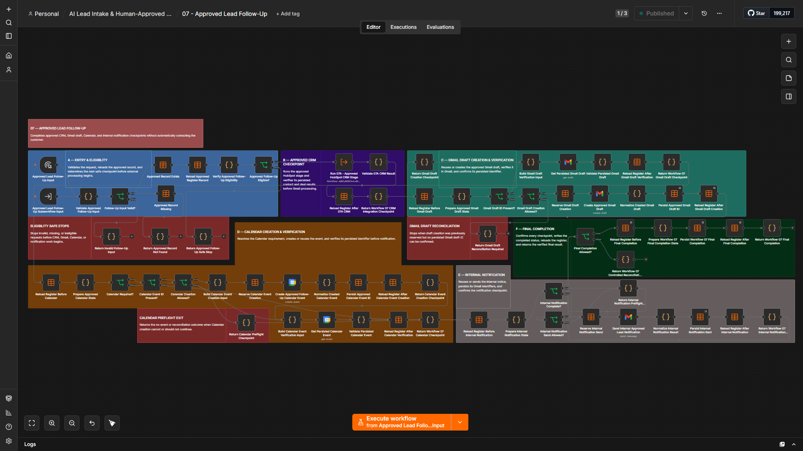

This workflow coordinates the work that happens after a lead has been approved.

It verifies the approved record, prepares the Gmail reply draft, creates an internal Calendar reminder when follow-up is required, sends the internal completion notification, and confirms the final persisted state before the process is marked complete.

Customer communication remains draft-only. The workflow prepares the response, but it does not send the customer email automatically.

## 07A — Approved HubSpot CRM Stage

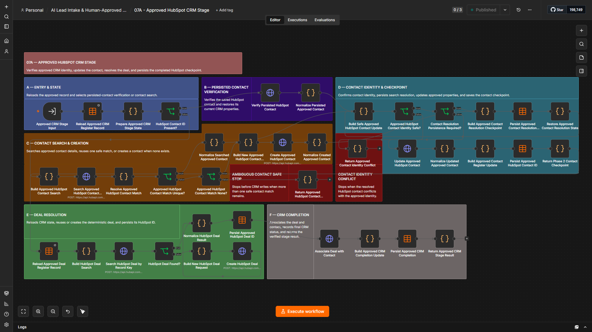

This is a supporting sub-workflow called by Workflow 07 to handle the HubSpot work required after a reviewer approves a lead.

It verifies the approved lead state, resolves the required contact and deal actions, updates HubSpot as needed, and writes the resulting CRM state back to the Lead Operations Register.

Keeping this stage separate makes the post-approval CRM work easier to verify without mixing it into the rest of the follow-up logic.

## 08A — Daily Lead Operations Reporting

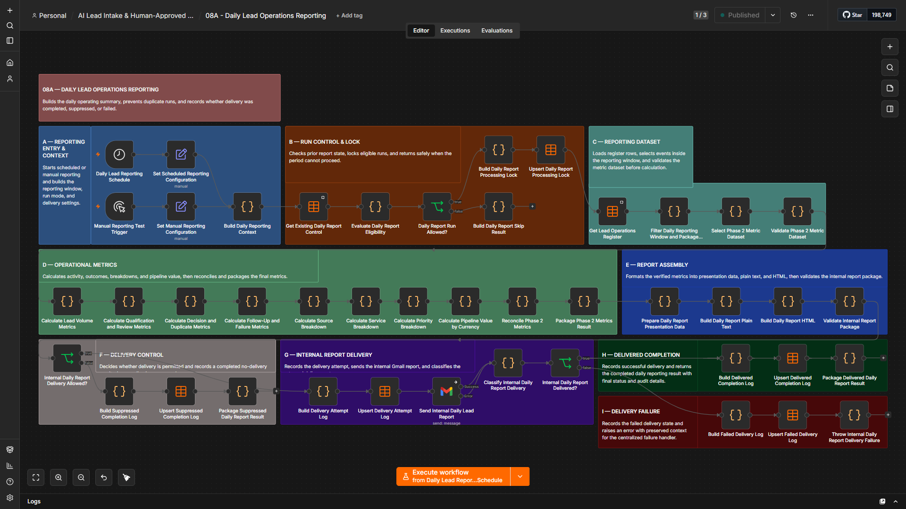

This workflow produces the internal daily lead-operations report.

It reads the reporting data for the defined America/New_York reporting window, summarizes lead activity and outcomes, builds the internal report, sends it through Gmail, and records the delivery result.

The report is operational only. It does not create or send customer-facing communication.

## 08B — Lead Operations Reporting Failure Handler

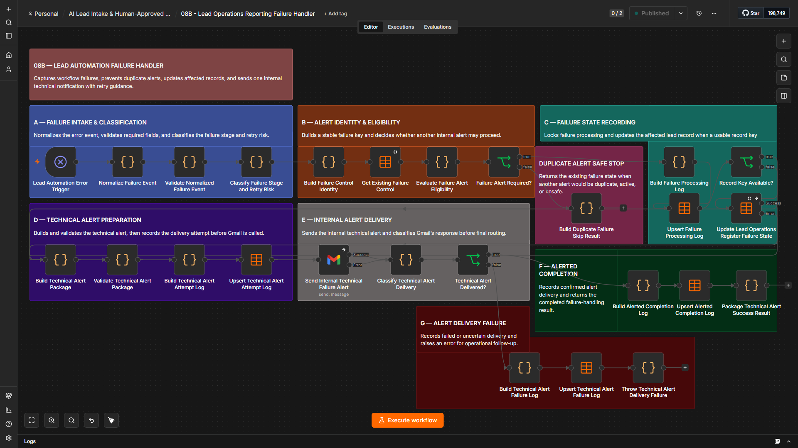

This workflow handles technical failures that need operator attention.

It captures the failed workflow, execution, node, failure stage, error details, and retry-risk context, then sends an internal alert with guidance for recovery.

The handler is designed to avoid blind retries when an external action may already have partially completed. The operator can first verify the Lead Operations Register and any stored external IDs before deciding whether a retry is safe.

## Design approach

The workflows are separated by responsibility rather than built as one large automation.

That structure makes it easier to:

- Test one part of the system without disturbing the rest
- Isolate failures to a specific stage
- Reuse persisted state between workflows
- Prevent duplicate external actions
- Keep approval logic separate from CRM and follow-up work
- Maintain reporting and failure handling independently

Important state is written back to the Lead Operations Register, including source identifiers, review status, HubSpot IDs, Gmail draft IDs, Calendar event IDs, processing state, and failure information.

This gives later stages something persistent to verify instead of relying only on the output of the previous workflow execution.

