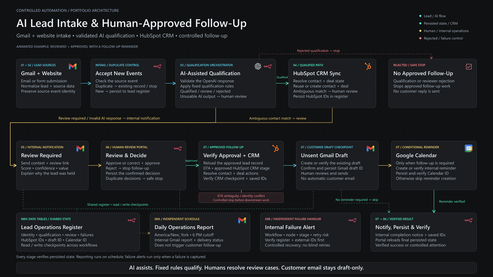
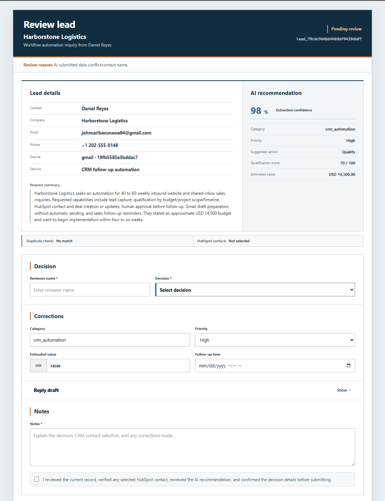
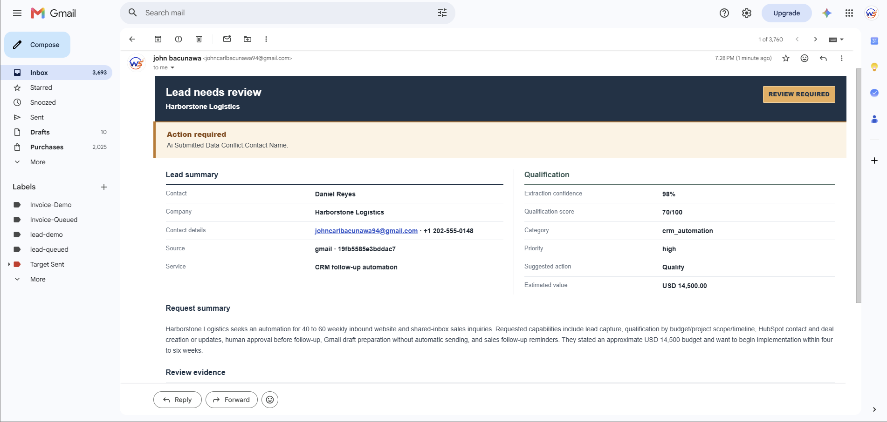
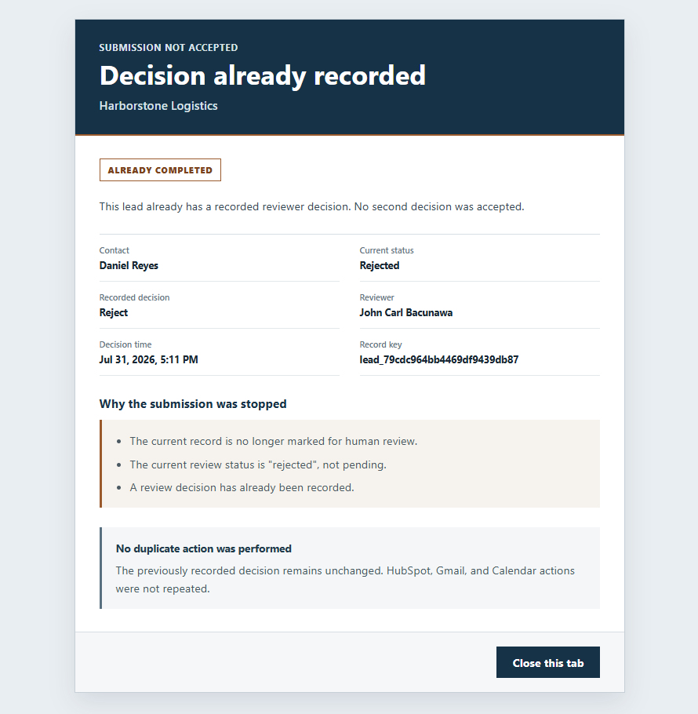
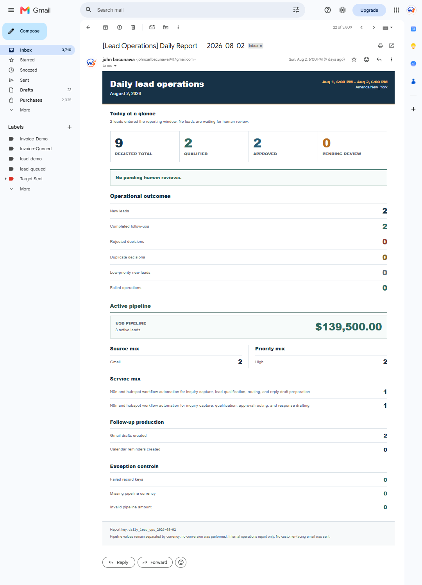
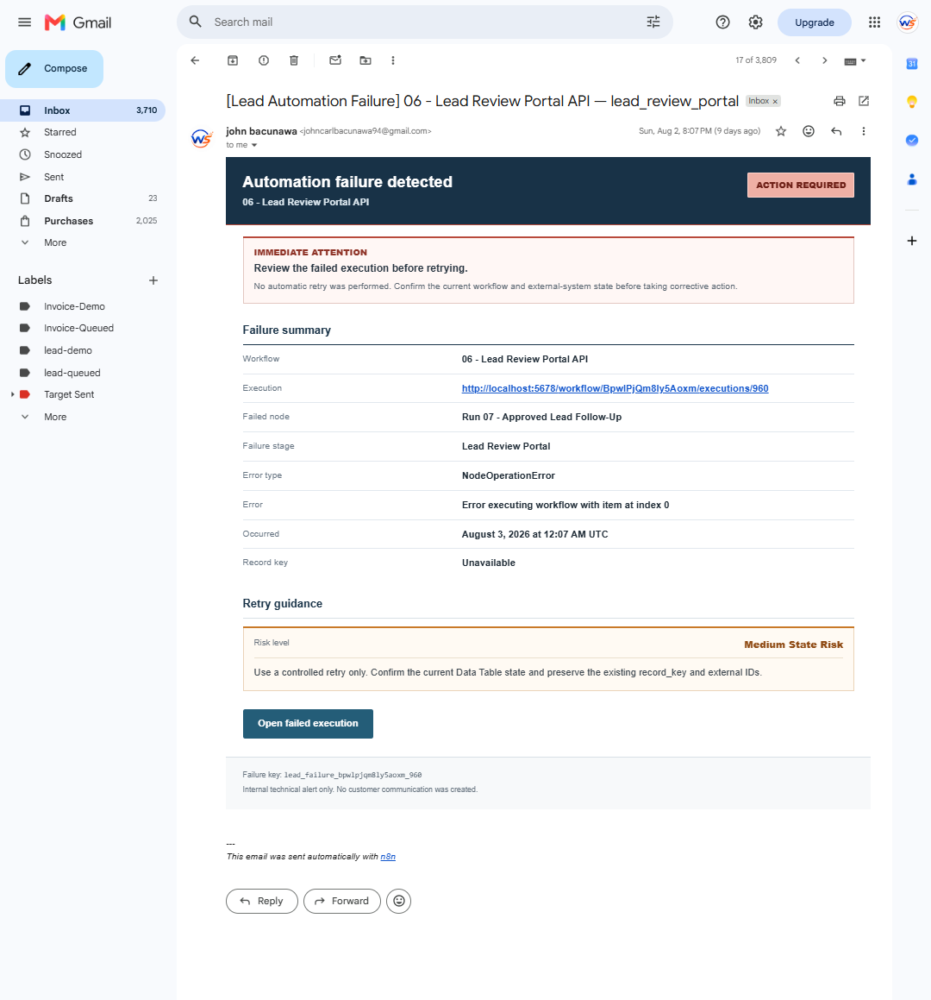

# AI Lead Intake, Qualification & Human-Approved Follow-Up

This project automates the lead-handling work that normally sits between a shared inbox, website form, CRM, and sales follow-up.

Leads can enter through Gmail or a website submission. Each lead is normalized, checked for duplicate source events, and evaluated using AI alongside fixed qualification rules. Straightforward leads can continue into HubSpot, while uncertain or conflicting cases are held for human review instead of being pushed through automatically.

The review step is deliberate. A reviewer sees the submitted lead information alongside the AI recommendation, can correct key details, and decides whether the lead should be approved or rejected.

Once approved, the workflow can update the HubSpot contact and deal, prepare a Gmail reply draft, create an internal follow-up reminder when one is needed, and record the final state in the lead operations register.

Customer email is never sent automatically. The workflow prepares the draft, but a person remains responsible for reviewing and sending it.

The system also includes daily operational reporting, duplicate-decision protection, and centralized failure alerts so the workflow can be monitored and recovered without blindly repeating actions in Gmail, HubSpot, or Google Calendar.

## Architecture Overview

The architecture separates multi-source lead intake, controlled qualification, human review, CRM synchronization, approved follow-up preparation, persistent operational state, and independent reporting.

AI assists with qualification and follow-up preparation, while deterministic rules and explicit human approval control what can proceed. Customer-facing email remains draft-only until a human reviews and sends it.

[View detailed architecture documentation →](ARCHITECTURE.md)

## What this system handles

The workflow covers the full lead path from intake through follow-up:

- Accepts leads from Gmail and website submissions
- Normalizes lead data into a shared register
- Prevents the same source event from being processed twice
- Uses AI to assist with qualification and prioritization
- Applies fixed business rules before deciding where a lead should go
- Sends uncertain cases to a human review queue
- Lets the reviewer approve, correct, or reject the lead
- Creates or updates the appropriate HubSpot records
- Prepares the customer reply as a Gmail draft
- Creates an internal Calendar reminder only when follow-up is required
- Records downstream IDs and final status for traceability
- Produces a daily internal operations report
- Sends internal failure alerts with enough context for a controlled retry

## Workflow structure

The project is split into separate workflows so each part of the process can be tested, monitored, and maintained without turning the entire automation into one oversized workflow.

### 01 — Gmail Lead Intake
Captures leads from Gmail, normalizes the incoming data, checks whether the source event has already been processed, and passes new leads into qualification.

### 02 — Website Lead Intake
Handles website submissions using the same lead register and duplicate-protection approach as the Gmail route.

### 03 — AI Lead Qualification Orchestrator
Evaluates the lead, validates the AI response, applies fixed qualification rules, and routes the record to CRM processing, human review, or rejection.

### 04 — HubSpot CRM Synchronization
Resolves the HubSpot contact and deal state, updates existing records when appropriate, and preserves the resulting HubSpot IDs in the lead register.

### 05 — Lead Review Notification
Sends the internal review notification when a lead needs a human decision.

### 06 — Lead Review Portal API
Provides the review interface and records the reviewer’s decision while protecting against repeated submissions.

### 07 — Approved Lead Follow-Up
Coordinates the approved follow-up path, including the Gmail draft, optional Calendar reminder, internal notification, and final verification.

### 07A — Approved HubSpot CRM Stage
Supporting sub-workflow used by Workflow 07 to handle the HubSpot contact and deal work required after approval.

### 08A — Daily Lead Operations Reporting
Builds and sends the internal daily report covering lead activity, outcomes, pipeline value, follow-up activity, and exceptions.

### 08B — Lead Operations Reporting Failure Handler
Captures workflow failures and sends an internal diagnostic alert with retry guidance.

## Controls and safeguards

A large part of this project was built around preventing duplicate actions and making failures easier to recover from.

### Duplicate source-event protection
Each intake route checks whether the incoming source event has already been recorded before qualification begins. If it already exists, the workflow returns the existing record instead of processing the lead again.

### Human approval for uncertain cases
Leads that do not meet the qualification rules cleanly are held for review. They do not continue automatically into customer follow-up.

### Customer email stays draft-only
The workflow can prepare the reply in Gmail, but it does not send the message to the customer. A person reviews and sends the final email.

### Duplicate decision protection
Once a review decision has been recorded, another submission is blocked so HubSpot updates, Gmail drafts, and Calendar actions are not repeated.

### External IDs are preserved
HubSpot contact IDs, deal IDs, Gmail draft IDs, and Calendar event IDs are written back to the lead register so later workflow stages can verify existing state instead of creating duplicate records.

### Controlled failure recovery
Technical failures are reported internally with the failed workflow, node, stage, error details, and retry-risk guidance. Where an external action may already have partially completed, the system avoids blindly repeating that action until the stored state and external IDs have been checked.

## Lead routing

Every lead ends up in one of three controlled paths.

### Qualified
The lead meets the qualification requirements and can continue into CRM processing.

### Review required
The lead is held for a human decision when the score is borderline, the submitted data conflicts with the AI interpretation, or another review condition is triggered.

### Rejected
The lead is stopped from continuing into approved follow-up. Rejected leads do not create customer-facing follow-up actions.

This separation keeps the workflow from treating every lead the same way and makes the review path explicit rather than hiding it inside a large automation.

## Human review process

When a lead requires review, the reviewer receives an internal notification with the lead details, qualification result, score, confidence, estimated value, and the reason the record was held.

The review portal then gives the reviewer a single place to compare the submitted information with the AI recommendation.

The reviewer can:

- Approve the lead as submitted
- Correct lead information and approve it
- Reject the lead
- Adjust classification or priority
- Correct the estimated value
- Set follow-up timing when needed
- Review the prepared reply draft
- Add decision notes

A decision must be explicitly confirmed before submission.

After the decision is recorded, the same record cannot be approved or rejected again. This prevents a repeated browser submission or accidental second click from triggering the downstream HubSpot, Gmail, or Calendar actions twice.

## Approved follow-up

Once a lead is approved, the downstream workflow verifies the CRM state and prepares the internal follow-up work.

The approved path can:

- Confirm the HubSpot contact
- Confirm or create the appropriate HubSpot deal
- Prepare the customer reply as a Gmail draft
- Create an internal Calendar reminder when follow-up is required
- Send an internal completion notification
- Verify the final lead record before marking the workflow complete

The Calendar step is conditional. If no reminder is needed, the workflow completes without creating one.

Customer communication remains draft-only throughout the process. The system prepares the message, but a person still reviews and sends it manually.

## Daily operations reporting

The project includes a scheduled internal report so lead activity can be reviewed without opening individual workflow executions.

The report summarizes:

- Total lead activity for the reporting window
- Qualified and approved leads
- Pending human reviews
- Rejected leads
- Pipeline value
- Lead sources
- Priority levels
- Services requested
- Gmail drafts created
- Calendar reminders created
- Operational exceptions and failures

The reporting window follows America/New_York time and is built around a 6:00 PM daily cutoff.

The report is for internal operations only. It does not trigger customer communication.

## Failure handling

Failures are handled separately from normal lead processing so technical problems do not get mixed into customer-facing workflow logic.

When a failure is captured, the internal alert includes:

- Workflow name
- Execution ID
- Failed node
- Failure stage
- Error type
- Error message
- Time of failure
- Retry-risk classification
- Guidance for a controlled retry

When an external action may already have partially completed, the workflow avoids blindly repeating that action. The current lead record and any stored external IDs can be checked first to determine what actually completed.

This reduces the risk of creating duplicate CRM records, duplicate drafts, Calendar reminders, or other repeated follow-up actions during recovery.

## Testing and validation

The system was tested across the main business routes rather than only checking whether individual nodes executed.

Verified scenarios included:

- Gmail lead intake
- Website lead intake
- Duplicate website source-event handling
- Automatically qualified leads
- Leads routed to human review
- Corrected and approved leads
- Rejected leads
- HubSpot contact and deal synchronization
- Reuse of an existing HubSpot contact
- Gmail draft creation
- Follow-up with a Calendar reminder
- Follow-up without a Calendar reminder
- Duplicate review-decision protection
- Daily operations reporting
- Centralized technical failure alerts

Artificial outages for services such as OpenAI, HubSpot, Gmail, and Google Calendar were not forced during the final acceptance pass. Those failure paths are handled in the workflow design, but they are not presented here as live-tested scenarios.

## Technology used

- n8n for workflow orchestration
- OpenAI API for lead analysis and qualification assistance
- HubSpot CRM for contact and deal management
- Gmail for lead intake, internal notifications, reports, and customer reply drafts
- Google Calendar for internal follow-up reminders
- n8n Data Tables for the lead operations register, reporting state, and failure records
- Webhooks and custom HTML for the human review portal
- JavaScript in n8n Code nodes for validation, normalization, routing, and verification logic

## Project outcome

The finished system provides a controlled lead-operations workflow that can handle intake, qualification, review, CRM synchronization, follow-up preparation, reporting, and failure visibility without relying on a single large automation.

The main result is a process that is easier to audit and safer to operate:

- Leads are not processed twice from the same source event
- AI output is checked before it influences routing
- Uncertain cases are held for review
- Customer replies stay under human control
- CRM and follow-up actions preserve external IDs for verification
- Repeated review submissions are blocked
- Daily activity is summarized automatically
- Failures are surfaced with enough context for a controlled recovery

The focus throughout the build was operational reliability, traceability, and recoverability rather than simply demonstrating a successful happy path.

## Project evidence

The screenshots below are taken from the working system and are included as supporting evidence for the project.

### Human review notification

### Human review portal

### Duplicate decision protection

### Daily operations report

### Technical failure alert

## Documentation

For a closer look at how the system is structured and how lead state is tracked:

- [System architecture](ARCHITECTURE.md)
- [Lead Operations Register data dictionary](DATA_DICTIONARY.md)

## Implementation note

The public portfolio focuses on architecture, workflow behavior, and working-system evidence. Full n8n workflow exports are not included because they contain environment-specific configuration and implementation details that are kept private.
